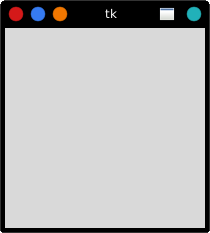
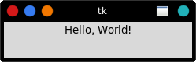
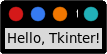
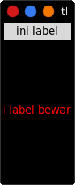

# Pemrograman GUI Python dengan Tkinter-Linux
Python memiliki banyak kerangka kerja GUI , tetapi Tkinter adalah satu-satunya kerangka kerja yang dibangun ke dalam pustaka standar Python. Tkinter memiliki beberapa kekuatan. Lintas platform, jadi kode yang sama berfungsi di Windows, macOS, dan Linux. Elemen visual dirender menggunakan elemen sistem operasi asli, sehingga aplikasi yang dibangun dengan Tkinter terlihat seperti berada di platform tempat mereka dijalankan.

Meskipun Tkinter dianggap sebagai kerangka kerja GUI Python de facto, itu bukan tanpa kritik. Satu kritik penting adalah bahwa GUI yang dibangun dengan Tkinter terlihat usang. Jika Anda menginginkan antarmuka modern yang mengkilap, maka Tkinter mungkin bukan yang Anda cari.

Namun, Tkinter ringan dan relatif tidak menyakitkan untuk digunakan dibandingkan dengan kerangka kerja lain. Ini menjadikannya pilihan yang menarik untuk membangun aplikasi GUI dengan Python, terutama untuk aplikasi di mana kilau modern tidak diperlukan, dan prioritas utamanya adalah dengan cepat membangun sesuatu yang fungsional dan lintas platform.

**Dalam tutorial ini, kita akan mempelajari cara:**
- Memulai aplikasi tkinter dengan Hello, World!
- Bekerja dengan widget seperti, buttons dan text boxes
- Control tata letak aplikasi dengan manajer geometry
- Jadikan aplikasi anda interaktif dengan mengaitkan klik tombol dengan fungsi python

Setelah menguasai keterampilan ini dengan mengerjakan latihan diakhir setiap bagian, Anda akan menyatukan semuanya dengan dua aplikasi. Yang pertama adalah konverter suhu, dan kedua adalah teks editor. Ok, lets Go! Kita pelajari aplikasi tkinter!

---
## Membangun Aplikasi GUI Pertama Dengan Tkinter
---
Elemen dasar GUI tkinter adalah window. Window adalah wadah dimana semua elemen GUI hidup. Elemen GUI lainnya yaitu, text boxes, label, dan button yang dikenal sebagai widget. widget terdapat didalam window.

Pertama buat window atau jendela berisi satu widget. Mulai sesi python shell.

**Install library tkinter**
```bash
sudo apt install python3-tk
```
Lanjut ketikan perintah di terminal
```
python3
```
import modul tkinter
```
import tkinter as tk
```
Jendela atau window adalah turunan dari class Tkinter. Mari kita membuat jendela baru dengan membuat variabel window:
```
window = tk.Tk()
```
kemudian enter, maka akan tampil sebuah jendela seperti berikut.



---
**Menambahkan Widget**
---
Kita sudah membuat jendela, lalu kita tambahkan widget dengan class `tk.Label` untuk menambahkan beberapa teks ke jendela. Buat label widget dengan teks 'Hello, World' dan tetapkan ke variabel greeting lalu enter:
```python
greeting = tk.Label(text='Hello, World!')
```
Jendela yang kita buat tidak akan berubah, karena kita hanya membuat sebuah widget, tetapi belum ditambahkan ke jendela. Cara menambahkannya, gunakan:
```python
greeting.pack()
```


saat mengemas widget ke dalam jendela. Tkinter mengatur ukuran jendela secara default biasanya mencakup ukuran teks. Sekarang jalankan perintah berikut:
```python
window.mainloop()
```
Seperti tidak ada perubahan kan! Perhatikan bahwa tidak ada line baru yang muncul di terminal. Hal ini karena `window.mainloop()` memberitahu python untuk menjalankan looping. Jadi sebelum proses selesai atau kita memberikan perintah untuk keluar jendela, sebuah line baru tidak akan muncul di terminal. Sekarang keluar dari jendela dan lihat, line baru akan muncul di terminal. Dan `.mainloop()` berguna agar program tidak berhenti saat membuat blok kode saat di run di teks editor.

---
**Periksa pemahaman**

Buatlah jendela tkinter seperti berikut menggunakn teks editor:



solusi:
```python
#!/usr/bin/python3

import tkinter as tk

window = tk.Tk()

label = tk.Label(text='Hello, Tkinter!')

window.mainloop()
```
---
**Widget**
---
Widget adalah roti dan mentega dari kerangka kerja GUI python tkinter. Mereka adalah elemen dimana pengguna berinteraksi dengan program. Setiap widget di tkinter didefinisikan oleh sebuah class. Berikut beberapa widget yang tersedia dan masih banyak lagi:

| class widget | keterangan |
| :-- | :-- |
| Label | widget yang digunakan untuk menampilkan teks di layar |
|Button| Tombol yang dapat berisi teks dan dapat melakukan tindakan saat di klik |
| Entry | widget entri yang hanya berisi satu baris teks |
| Text | widget entri teks multi baris |
| Frame | rectangle region yang digunakan untuk mengelompokan widget terkait atau menyediakan padding antar widget |

Kita akan mempelajari cara kerja masing-masing widget tersebut, kita tidak akan membahas widget lainnya.

---
### Menampilkan Teks dan Gambar dengan widget Label
---
```python
#!/usr/bin/python3

import tkinter as tk

window = tk.Tk()

# membuat label
label1 = tk.Label(text='ini label')

''' ini label bewarna
gunakan:
foreground untuk merubah warna tulisan, bisa disingkat fg
background untuk warna label, bisa disingkat bg
'''
label2 = tk.Label(text='ini label bewarna', fg='red', bg='black', width='10', height='10')

# tambahkan ke jendela
label1.pack()
label2.pack()

# loop
window.mainloop()
```
Tampilan jendela:



Untuk melihat warna [disini](https://www.tcl.tk/man/tcl/TkCmd/colors.html).

selain itu kita bisa menggunakan warna RGB, tapi tidak akan kita bahas.

